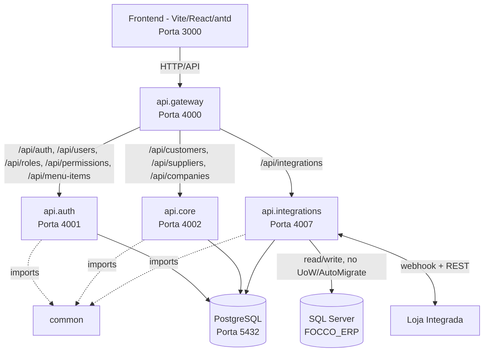

# CLAUDE.md

This file provides guidance to Claude Code (claude.ai/code) when working with code in this repository.

## Project Overview

Lumini Hub is an ERP system with a Go microservices backend (`Backend/`) and a Vite + React + Ant Design frontend (`Frontend/`). It is being migrated feature-by-feature from a legacy monolith, organized around ERP modules (CRM, Estoque/Produtos, Compras, Vendas/Caixas, Financeiro, Fiscal, Contabilidade) tracked in `Documentos/Planejamento/`.

## Commands

### Backend (Go, from `Backend/`)
```powershell
.\run_services.bat        # starts api.gateway (4000), api.auth (4001), api.core (4002) in separate windows
go build ./...             # build all workspace modules
go test ./...               # run tests (few exist today, e.g. common/database/db_sqlserver_test.go)
```
Requires a local PostgreSQL on port 5432 and a `Backend/.env` (see `Backend/.env.example`).

Regenerate Swagger docs after adding/changing handlers (run from `Backend/microservices/api.gateway/`):
```powershell
swag init -g main.go -d ./,../../common,../api.auth,../api.core --parseDependency
```

### Frontend (Vite + React, from `Frontend/`)
```powershell
pnpm install
pnpm dev      # Vite dev server at http://localhost:3000 (port pinned in vite.config.ts to match gateway CORS)
pnpm build    # tsc -b && vite build
pnpm lint     # eslint .
```
No frontend test runner is currently configured. Requires `Frontend/.env.local` with `VITE_API_URL` (defaults to `http://localhost:4000/api`, i.e. the gateway).

Local login: `admin` / `987321`.

## Backend Architecture

Go Workspace (`Backend/go.work`) with five modules:
- **`common/`** — shared package: `config` (env loading), `database` (GORM/Postgres pool), `middlewares` (`AuthMiddleware` JWT-from-cookie, `RequirePermission` RBAC), `utils` (JWT, bcrypt, `response.go`, pagination), `repository` (generic `Repository[T]` / `GormRepository[T]`).
- **`microservices/api.gateway`** (port 4000) — sole entrypoint. Reverse-proxies by path prefix to the other services and is the **only** place CORS is configured.
- **`microservices/api.auth`** (port 4001) — users, roles, permissions, menu items (dynamic sidebar tree), login/refresh (HTTP-only cookies).
- **`microservices/api.core`** (port 4002) — customers, suppliers, addresses, contacts, documents, companies (multi-company, see `Company` below).
- **`microservices/api.integrations`** (port 4007) — bidirectional sync middleware with the legacy SQL Server ERP and Loja Integrada, see [dedicated section](#legacy-sql-server-integration-apiintegrations-port-4007) below.



`api.auth`, `api.core` and `api.integrations` share one physical Postgres database during this migration phase but never join across each other's tables — cross-service data (e.g. `User` inside a Customer DTO) is passed as plain IDs and re-hydrated into a local simplified struct (e.g. `ApiUser`), not a GORM relation.

### Mandatory backend patterns
- **Responses**: every handler returns via `utils.SuccessResponse` / `utils.ErrorResponse` / `utils.ValidationErrorResponse` ([response.go](Backend/common/utils/response.go)). Never hand-roll `gin.H` payloads.
- **Repository**: microservice-specific repositories extend the generic `commonrepo.Repository[T]` and override methods like `FindByID` when GORM `Preload` is needed.
- **Unit of Work**: services never touch a repository or `*gorm.DB` directly — they call `s.uow.Execute(func(uow repository.UnitOfWork) error { ... })` so writes are atomic. Each microservice defines its own `UnitOfWork` interface (see `api.core/internal/repository/repository.go`) exposing one method per aggregate (`Customers()`, `Suppliers()`, ...).
- **Search**: complex/paginated queries are POST endpoints ending in `/filter` (a `<Entity>FilterRequest` DTO with `page_no`, `page_size`, `order_by_column`, `is_asc`), not query-string GETs. Results go through `utils.Paginate`.
- **CORS**: only ever configured in `api.gateway/main.go`. Adding it to `api.auth` or `api.core` causes duplicate-header `AxiosError: Network Error` in the browser.
- **RBAC (hybrid)**: a `Role` is only a template/default — creating or editing a user picks a Role, which pre-fills a default set of permissions, but what `RequirePermission` middleware actually checks is the permission list embedded in the JWT, which comes from the user's own direct `user_permissions` link (`api.auth/internal/domain/user.go`), not from the Role. Operators can freely add/revoke individual permissions on a user beyond their Role's defaults (`PUT /users/:id/permissions`). The Role/permission catalog itself (`/settings/roles`, "Perfis e Permissões") is a developer-only screen gated by the `admin.create_permissions` permission — creating a permission there has no effect unless a matching `RequirePermission("...")` already exists in code.
- **RBAC bypass is two-tiered** (`common/utils/rbac.go`, 2026-07-19): `DEVELOP` bypasses every `RequirePermission` check and sees the full menu, no exceptions. `ADMIN` bypasses everything **except** *writing* to the Perfis/Permissões catalog itself (`utils.IsDeveloperOnlyPermission`: `admin.create_permissions` + any `roles.*`/`permissions.*` code **except** `roles.view`/`permissions.view`, which stay open to ADMIN because the Users create/edit screens need them to populate the Perfil/permission pickers) — creating/editing/deleting Roles or Permissions, and the "Perfis e Permissões" menu entry, are DEVELOP-only. Reasoning: creating a permission with no matching `RequirePermission("...")` in code does nothing, so this is a developer tool, not a business-admin one. Both the backend (`middlewares.RequirePermission`, `domain.FilterMenuTreeForUser`) and the frontend (`AuthContext.tsx`'s `hasPermission`) implement this same tiering — keep them in sync if it changes. There is no seeder for the `DEVELOP` role or its permission grants; it's created and populated manually in the DB (`user_permissions`) per-environment, not via code.
- **The `DEVELOP` role and its users are invisible to everyone except DEVELOP itself** (`user_service.go`/`role_service.go`, 2026-07-20): `GET /users`/`GET /users/:id` never return a user whose Role is `DEVELOP` unless the requester's own role is `DEVELOP` (filtered at the SQL level for the list, via a `role_id NOT IN (SELECT id FROM roles WHERE name = 'DEVELOP')` subquery, so pagination totals stay correct; a direct `GET /users/:id` on a hidden user returns 404, not 403 — existence isn't revealed). Same treatment for `GET /roles`/`GET /roles/:id` and the Role's own CRUD (`UpdateRole`/`DeleteRole`/`UpdateRolePermissions` all 404 on the DEVELOP role for non-DEVELOP callers). `CreateUser`/`UpdateUser` also reject assigning the DEVELOP role's ID to a user unless the actor is DEVELOP (generic "perfil inválido" error — doesn't leak the role's name). Requester's role comes from `utils.RoleFromGinContext(c)`, threaded through the service layer as a plain string param — no repository/service method here takes `isAdmin bool` anymore, they take `requesterRole string`.
- **Routing**: new route prefixes must be registered both in the microservice's own routes file and proxied from `api.gateway/main.go` (via `router.NoRoute`, careful not to collide with `/swagger/*any`).

### Adding a new entity (Core or Auth microservice)
Follow this order (see `.claude/skills/lumini_hub_entity_creation/SKILL.md` for full detail):
1. `internal/models` (or `domain`) — GORM struct + `Create<Entity>Request`/`Update<Entity>Request` with `binding` validation tags.
2. `internal/models/<entity>_dto.go` — DTOs + `ToDTO()`/`ToDetailDTO()` mappers.
3. `internal/repository/<entity>_repository.go` — interface extending `commonrepo.Repository[domain.<Entity>]` + GORM impl, with `Preload` overrides as needed.
4. `internal/validator/<entity>_validator.go` — business-rule validation (uniqueness, nested items).
5. `internal/service/<entity>_service.go` — business logic, all writes wrapped in `s.uow.Execute(...)`.
6. `internal/handlers/<entity>.go` — CRUD + `/filter` search, Swagger annotations, standard response helpers.
7. `internal/routes/<entity>_routes.go` — register on the Gin router group with auth/role middleware.
8. Wire repository → validator → service → handler → routes in `internal/server/server.go` (or equivalent init).
9. Add the new struct to the `AutoMigrate` chain.
10. Seed default data if applicable.
11. Register `view_/create_/edit_/delete_<entity>` permissions and map them to the `ADMIN` role in seeders.
12. Regenerate Swagger (command above).

Filenames are snake_case (`customer_supplier_repository.go`), and controllers must never bind directly to repositories — always Service → UoW.

### Legacy SQL Server Integration (`api.integrations`, port 4007)

**Phase 1 is implemented and running** (see `Documentos/Planejamento/Modulo_1_CRM_Integracoes/tasks_integrations.md` for the exact checklist): the module skeleton, Postgres domain/repositories/UoW, read-only legacy SQL Server layer, `ConfigService`, handlers/routes (`/settings`, `/sync-logs/filter`, `/webhook-events/filter`, `/legacy/locations`, `/legacy/companies`, `/webhooks/loja-integrada`), the gateway proxy, `run_services.bat` entry, and a frontend Configurações → Integrações screen are all done. It is a **bidirectional sync middleware** between the **Loja Integrada** e-commerce platform and the client's legacy SQL Server ERP (`FOCCO_ERP`), which this project is gradually replacing:
- **Loja Integrada → SQL Server**: a webhook receiver imports web orders as sales notes (`tipentsai=50`) into the legacy DB. *(Phase 2, not yet implemented — see below.)*
- **SQL Server → Loja Integrada**: polls the `LogAltera` change-log table and pushes product/price/stock updates to the LI REST API. *(Phase 2, not yet implemented.)*
- Owns its own PostgreSQL persistence for sync state: `SyncLog`, `ProductMapping`, `WebhookEvent`, `IntegrationConfig` (API keys, `codtipnot`, `codlocarm_oficial`/`codlocarm_reserva`, `codemp` — cached in memory, not re-read per request).

Because it talks to the legacy DB, it breaks from the api.core/api.auth pattern: no `UnitOfWork`/`AutoMigrate` against SQL Server tables (schema is owned by the legacy system), and writes there (e.g. incrementing `CADSEQ` sequences) must run inside an explicit SQL Server transaction with `UPDLOCK` to stay atomic, mirroring the legacy `GetSequencia` logic (select → increment → update).

Legacy schema glossary (FOCCO_ERP / SQL Server) relevant to this integration:
- `LogAltera` — change log used for polling; `TipoAlt` (`P`=Produto, `V`=Preço Venda, `U`=Custo), `DatFimAlt` (polling cursor), `codRegAlt` (=`codpro`).
- `NOTAS` / `NOTAS1` / `NOTAS3` — order header / line items / payment plan; composite key `(tipentsai, nroentsai)`.
- `CADSEQ` — sequence generator table (`GetSequencia` pattern).
- `CADPRO.codint` — stores the product's Loja Integrada ID (the cross-system mapping field).
- `LOCARM` / `CENCUS` — stock locations and companies. Stock flow on a web sale: **Oficial → Reserva** (moved on web sale close) → **sent to customer** (on financeiro invoicing/faturamento).

**Phase 2 (not yet implemented)**: `NOTAS`/`NOTAS1`/`NOTAS3`/`CADPRO` domain + real sales-note creation from an LI order, the Loja Integrada HTTP client (products/orders), the polling scheduler that actually pushes `LogAltera` changes to LI, and processing a received `WebhookEvent` into a sales order. Blocked on: Loja Integrada API/App keys, the `codtipnot` value to use for LI-originated orders, and the stock-priority policy between the physical and web store when both sell the last unit concurrently (pending confirmation with the client's board).

## Frontend Architecture

Vite + React 18 + TypeScript + React Router v6 + Ant Design v5 (`antd`). The frontend was rebuilt from scratch on 2026-07-19 — the previous Next.js App Router + Tailwind + `rizzui`/Radix stack was fully deleted and replaced, not extended. Path alias `@/*` → `Frontend/src/*`. The dev server is pinned to port 3000 in `vite.config.ts` — required because the gateway's CORS only allows `http://localhost:3000`/`:3001`.

There is no more "hybrid UI" split for the CRM module — `antd` is the sole UI library for the whole app now (no Tailwind, no rizzui/Radix).

- **`src/types/`** — one file per entity, TS interfaces mirroring the backend Go DTOs (`auth.ts`, `user.ts`, `role.ts`, `permission.ts`, `menu.ts`, `customer.ts`, `supplier.ts`), plus `common.ts` for the shared `ApiResponse<T>`/`ApiPagination` envelope. `crm.ts` is explicitly mock-only (see below).
- **`src/services/`** — one file per entity (`auth/auth-service.ts`, `users/user-service.ts`, `roles/role-service.ts`, `permissions/permission-service.ts`, `customers/customer-service.ts`, `suppliers/supplier-service.ts`), each wrapping the shared axios instance. No page/component calls axios directly.
- **`src/services/common/api.ts`** — the single axios client (`withCredentials: true`, base URL from `VITE_API_URL`). Response interceptor auto-retries once via `/auth/refresh-token` on 401 (skipping the login/refresh calls themselves); on refresh failure it hard-redirects to `/login`, **except** for the initial `/auth/me` session-bootstrap call, which is left to fail gracefully through `AuthContext` + `ProtectedRoute`'s own SPA redirect instead of forcing a full page reload.
- **`src/schemas/`** — one Zod schema per form (`login-schema.ts`, `forgot-password-schema.ts`, `create-user-schema.ts`, `update-user-schema.ts`), validation aligned to the backend's `binding` tags.
- **`src/contexts/`** — `AuthContext.tsx` (bootstraps session via `GET /auth/me` on load, exposes `user`, `menuItems`, `login()`, `logout()`, `hasPermission()`) and `ThemeContext.tsx` (dark/light, persisted in `localStorage`, feeds `ConfigProvider`'s `theme.darkAlgorithm`/`defaultAlgorithm` via `src/theme/antd-theme.ts`).
- **`src/routes/`** — `router.tsx` (route tree), `ProtectedRoute.tsx` (session gate), `RequirePermission.tsx` (per-route permission gate — UI convenience only, the backend `RequirePermission` middleware is the real enforcement), `AuthLayout.tsx` (centered card shell for Login/Recuperar senha), `AppLayout.tsx` (`Layout.Sider` 240/76px collapsible + `Layout.Header` + `Layout.Content`).
- **`src/pages/`** / **`src/components/`** — organized by domain (`pages/auth/`, `pages/dashboard/`, `pages/users/`; `components/layout/`, `components/dashboard/`, `components/users/forms/`, `components/common/`). `pages/PlaceholderPage.tsx` is the catch-all fallback for any DB-seeded menu `href` that doesn't have a real screen yet.
- All API calls go through the gateway (`http://localhost:4000/api/...`), never directly to `api.auth`/`api.core` ports.

### Sidebar menu is data-driven, not hardcoded

The sidebar (`src/components/layout/SidebarMenu.tsx`, recursive antd `Menu`, arbitrary depth) renders from `user.menuItems`, which comes from the login/refresh/me response body — **not** from a static config file. Source of truth is the `menu_items` table in `api.auth` (self-referencing `MenuItem` domain, `internal/domain/menu_item.go`), managed via `/menu-items` (dev-only, gated by `admin.create_permissions`, no admin UI yet — CRUD only). `AuthService.GetMenuItemsForUser` builds the tree and filters it per user (ADMIN sees everything; a node with an `href` needs its own linked permission or an ADMIN bypass; a pure group node with no `href` is visible only if it has a visible descendant — never grant it access on its own, since it has no permission of its own to check). Icons are Iconify strings (`ph:` prefix = Phosphor) resolved via `@iconify/react`'s `<Icon>` component, not JSX. **antd `Menu` item `key`s must be built from the item's `id`, not its `href`** — the real seeded tree has duplicate hrefs at different tree positions (e.g. "Clientes" appears both under Vendas > Cadastros and under Financeiro > Contas a Receber, both pointing at `/customers`), which collides if `href` is used as the key. Seeded hrefs are nested paths like `/settings/users`, not flat ones — always check the actual login response's `menu_items` before wiring a new frontend route, don't assume the path. To change the menu tree, edit rows in `menu_items` (or, for the seed defaults, `internal/seeder/menu_item_seeder.go`).

### Mandatory frontend CRUD pattern

Entity Cadastro (create) and Edição (edit) are **full pages**, not modals — e.g. `src/pages/users/CreateUserPage.tsx` / `EditUserPage.tsx`, registered in `src/routes/router.tsx`, each rendering a form component from `src/components/<domain>/forms/` (e.g. `CreateUserForm.tsx`/`EditUserForm.tsx`). Validation is `react-hook-form` + `zodResolver` against a schema in `src/schemas/`, reusing the shared `FormField` wrapper (`src/components/common/FormField.tsx`, thin layer over antd `Form.Item`) for label+error display. Complex forms are split into `antd Tabs` (e.g. "Dados do Usuário" vs "Permissões") rather than one long scroll. On submit, `navigate()` back to the list route; `App.useApp()`'s `message`/`notification` for feedback.

Modals are reserved for **confirming destructive/user actions** — never for data entry forms.

Non-Zod-managed sub-sections (e.g. the Perfil/permissions picker tied to a user but not itself a form field) live as sibling `useState` in the form component, not inside the RHF schema — see `CreateUserForm.tsx`/`EditUserForm.tsx`: the Perfil preset buttons (`RolePresetPicker.tsx`, roles fetched live from `GET /roles`) drive `ModulePermissionsPanel.tsx`, which shows only the permissions of the module whose name matches the selected Perfil, falling back to the first module with a selected permission when the names don't match (the Role/module naming in the seeded catalog isn't fully consistent yet — e.g. "Gerente"/"ADMIN" roles have no same-named module).

This pattern is fully implemented for **Usuários** (`/settings/users`) and **Empresas** (`/settings/companies`, added 2026-07-27 as part of the multi-company foundation — `src/pages/settings/companies/`, `company-service.ts`, `company-schema.ts`). The frontend was rebuilt from scratch on 2026-07-19; Login, Recuperar senha (UI-only, no backend endpoint yet), Dashboard CRM (mocked, no `api.crm` backend yet) and Configurações → Integrações (real, see `api.integrations` above) round out what's real today — every other sidebar destination falls through to `PlaceholderPage`. Apply this pattern when building each of those out.

## Development Workflow / Planning

`Documentos/Planejamento/` is the authoritative task tracker for this project and applies to **all agents and developers**, not just this session:
- `Documentos/Planejamento/README.md` explains the module breakdown (`Modulo_0_Configuracao` ... `Modulo_7_Contabilidade`).
- Before starting a feature, read the module's `plano_*.md` (scope, DB, business rules, affected files) and `tasks_*.md` (current status).
- Concurrent task locking in `tasks_*.md`: pick a free task (`- [ ]`), mark it `- [/] [EM EXECUÇÃO POR: NOME_DO_AGENTE]` and save *before* touching code; never start a task already tagged `[EM EXECUÇÃO POR: ...]` or `[BLOQUEADO POR: ...]`. On success mark `- [x] [CONCLUÍDO POR: NOME_DO_AGENTE]`; on interruption, revert to `- [ ]`.
- At the end of a working session, add/update `Documentos/Planejamento/Historico/log_YYYY-MM-DD.md` with what was done and what's pending, and update the relevant `tasks_*.md`.

Full skill definitions for the above (loaded automatically by Claude Code from `.claude/skills/`): `lumini_hub_backend_architecture`, `lumini_hub_dev_flow`, `lumini_hub_entity_creation`.
