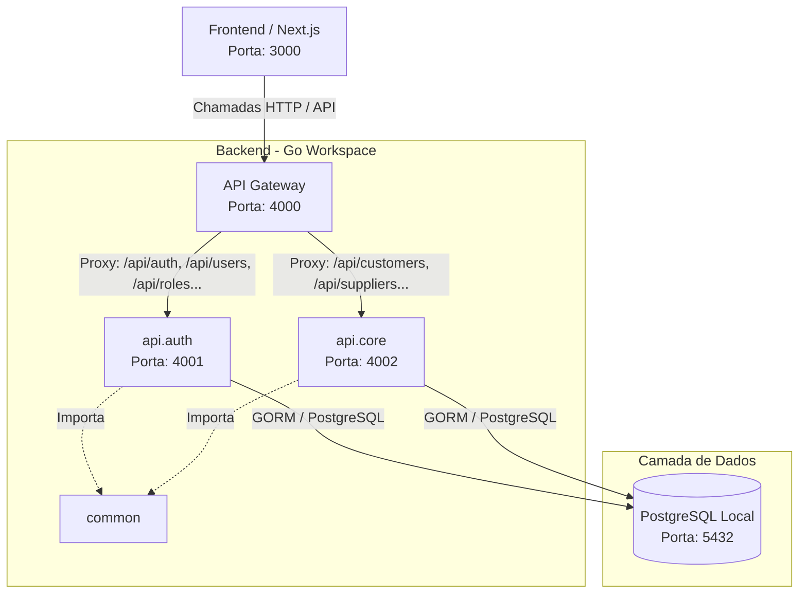

# Arquitetura de Microsserviços - Lumini Hub Backend

Este documento apresenta os detalhes da arquitetura de microsserviços implementada para o backend do **Lumini Hub**, que migrou de uma arquitetura monolítica para uma estrutura modular baseada em **Go Workspaces (`go.work`)**.

---

## 1. Visão Geral da Arquitetura

O sistema foi redesenhado para separar responsabilidades fundamentais do negócio em microsserviços autônomos, utilizando um **API Gateway** unificado como ponto único de entrada para o Frontend (Next.js).



---

## 2. Divisão de Módulos e Responsabilidades

O workspace em Go é gerenciado na raiz pelo arquivo `go.work` e é dividido em quatro componentes principais:

### 2.1. `common` (Módulo Compartilhado)
Contém os recursos compartilhados que são importados diretamente pelos microsserviços. Isso evita duplicação de lógica essencial.
*   **`config`**: Gerencia o carregamento de variáveis de ambiente. Implementa uma busca inteligente recursiva do arquivo `.env` para subir os níveis de diretório, garantindo que a execução funcione tanto a partir do diretório raiz quanto de subpastas.
*   **`database`**: Gerencia o pool de conexões com o PostgreSQL via GORM.
*   **`middlewares`**: Centraliza middlewares reutilizáveis como:
    *   `AuthMiddleware`: Validação de tokens JWT extraídos de cookies HTTP-Only ou cabeçalhos.
    *   `RequirePermission`: Middleware RBAC (Role-Based Access Control) que verifica se o usuário possui permissão específica antes de autorizar a requisição.
*   **`utils`**: Funções utilitárias como geração/validação de tokens JWT, criptografia de senhas (bcrypt), estruturação de respostas JSON padronizadas e utilitários de paginação genérica do GORM.

### 2.2. `api.gateway` (Porta `4000`)
Atua como o proxy reverso transparente e porta de entrada única do sistema.
*   **Roteamento:** Mapeia prefixos de rotas para os seus respectivos microsserviços:
    *   `/api/auth/**`, `/api/users/**`, `/api/roles/**`, `/api/permissions/**` $\rightarrow$ Repassado para `api.auth` (Porta `4001`)
    *   `/api/customers/**`, `/api/suppliers/**` $\rightarrow$ Repassado para `api.core` (Porta `4002`)
*   **CORS Centralizado:** O CORS é gerenciado **exclusivamente** no Gateway para evitar que os navegadores rejeitem requisições por cabeçalhos CORS duplicados (um clássico problema ao colocar middlewares CORS no Gateway e nos serviços de destino simultaneamente). Ele aceita a origem `http://localhost:3000` (Frontend) e suporta `AllowCredentials` para tráfego seguro de cookies.
*   **Proxy Seguro:** Utiliza `httputil.NewSingleHostReverseProxy` do Go, reescrevendo o cabeçalho `Host` da requisição dinamicamente para corresponder ao destino.

### 2.3. `api.auth` (Porta `4001`)
Microsserviço responsável pela segurança, gestão de usuários e autorização.
*   **Modelos de Domínio:** `User`, `Role` (Papel), `Permission` (Permissão) e tabelas de associação do GORM.
*   **Funcionalidades:**
    *   Login, Logout e Refresh Token (utilizando Cookies HTTP-Only protegidos).
    *   Consulta de perfil do usuário logado (`/me`).
    *   Cadastro e gerenciamento completo de usuários.
    *   Configuração e associação de perfis e permissões.

### 2.4. `api.core` (Porta `4002`)
Microsserviço responsável pelas regras de negócios e cadastros principais do ERP.
*   **Modelos de Domínio:** `Customer` (Cliente), `Supplier` (Fornecedor), `Address` (Endereço), `Contact` (Contato) e `Document` (Documento).
*   **Desacoplamento de Domínio:** Para evitar um acoplamento direto com o banco do microsserviço de autenticação, o relacionamento físico do GORM com a struct `User` foi removido. Em vez disso, tabelas no core usam IDs numéricos diretos (`CreatedByID`, `UpdatedByID`). Na exibição detalhada de clientes/fornecedores, o DTO do Core expõe uma struct simplificada `ApiUser` preenchida localmente, mantendo total compatibilidade com o formato JSON esperado pelo Frontend.

---

## 3. Modelo de Banco de Dados de Transição

Ambos os microsserviços conectam-se ao mesmo banco de dados PostgreSQL físico local (`lumini-hub` na porta `5432`) como parte de uma estratégia de transição gradual para microsserviços. 

*   **Vantagem:** Facilita a migração imediata do monólito e a comunicação entre tabelas sem a necessidade de APIs síncronas complexas ou mensageria em lote nesta fase.
*   **Isolamento lógico:** Embora compartilhem o banco de dados físico, os microsserviços interagem apenas com suas tabelas de domínio. Nenhum microsserviço realiza joins entre tabelas pertencentes a outros microsserviços.

---

## 4. Inicialização do Backend

Para facilitar o desenvolvimento local, foi criado um script em lote na raiz do backend ([run_services.bat](file:///c:/Projetos/lumini-hub/Backend/run_services.bat)) que gerencia a compilação e inicialização de todos os serviços.

### Passos para rodar localmente:
1. Abra um terminal na pasta raiz `Backend`
2. Execute o comando:
   ```powershell
   .\run_services.bat
   ```
3. O script irá abrir três janelas de prompt de comando do Windows independentes:
   - Uma para a `api.auth`
   - Uma para a `api.core`
   - Uma para o `api.gateway`

Para desligar, basta fechar as janelas do console correspondentes.

---

## 5. Práticas e Guia para Extensões Futuras

### Como adicionar uma nova rota a um microsserviço existente:
1. Defina a lógica no Handler correspondente do microsserviço (ex: `api.core/internal/handlers/`).
2. Registre a rota no arquivo de rotas do microsserviço (ex: `api.core/internal/routes/routes.go`).
3. Caso a rota use um novo prefixo de URL (ex: `/api/products`), atualize o arquivo [api.gateway/main.go](file:///c:/Projetos/lumini-hub/Backend/microservices/api.gateway/main.go) para direcionar as requisições que começam com esse prefixo para o microsserviço correto (`coreURL`).

### Como criar um novo microsserviço do zero:
1. Crie uma pasta sob `microservices/` (ex: `microservices/api.inventory`).
2. Inicialize o módulo Go: `go mod init lumini-hub/api.inventory`.
3. Adicione o novo diretório no arquivo `go.work` na raiz do backend executando:
   ```bash
   go work use ./microservices/api.inventory
   ```
4. Crie o arquivo `main.go` escutando em uma nova porta livre (ex: `4003`).
5. Adicione o novo microsserviço no arquivo `run_services.bat` para ser iniciado com os outros.
6. Configure as regras de roteamento no `api.gateway/main.go` para mapear as novas URLs para a porta `4003`.
